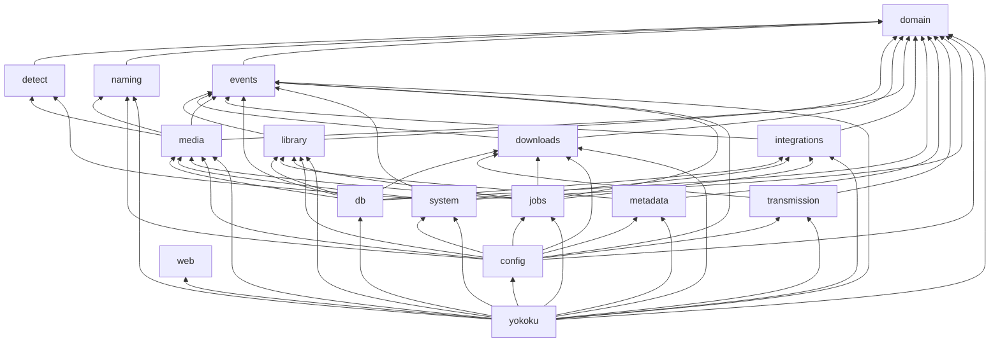

# Navigability audit

Audit baseline: `main` at `5a0d5b0` with a clean working tree. The staged changes described in the brief had already been committed when the audit ran. Scope: the 16 crates under `crates/`, 253 `.rs` files and about 29.1k lines. `target/` is excluded.

This document is analysis and a plan. No source file was changed.

---

## 1. Summary

Highest-impact findings:

1. **The crate layering is sound, but no map connects a feature to its code.** A feature such as "import a finished download" touches 8 crates (`detect`, `naming`, `media`, `events`, `db`, `system`, `jobs`, `yokoku`). ARCHITECTURE.md describes the layers, but no feature-to-file index exists. This is the root cause of pain point 3. The best fix is a "where things live" map (§7), not moving code.
2. **The Jellyfin HTTP client is in `system`** (`crates/system/src/jellyfin.rs`), a crate that otherwise holds local-host adapters (fs, lock, clock, ffprobe, spool). Every other external service has an adapter named after it (`transmission`, `metadata/tmdb.rs`, `metadata/tvdb.rs`). `jellyfin.rs` is the only reason `system` depends on `reqwest`, `wiremock` and `yokoku-integrations`.
3. **`db/src/media_repo.rs` (423 lines) implements three ports**: `media::ports::MediaRepo` (:68), `media::ports::Catalog` (:214), `library::ports::MediaFiles` (:233). Every other `db` file implements exactly one port and is named after it (`series_repo.rs`, `rescan_store.rs`, …).
4. **Names that don't predict their contents:** `events/src/log.rs` holds the `EventLog` port, while its implementation is `db/src/event_log.rs`. `metadata/src/wire.rs` holds TMDB-only shapes, while its sibling is named `tvdb_wire.rs`. Four crates each have a `settings.rs` with three different meanings.
5. **`domain/src/series.rs` (541 lines) mixes two concepts.** The shared `EpisodeRef`/`EpisodeSpan` value types (:81–187, used by `detect`, `naming`, `media`, `db` and the event contract) sit next to the `Series` aggregate.
6. **`domain/src/events.rs` (610 lines) is 53% inline tests** (:289–610), even though `domain/tests/events.rs` also exists. The tests for one module are in two places.
7. **Renumbering lives inside `scan.rs`.** The `EpisodesRenumbered` reaction (`media/src/scan.rs:147–196, 223–229`) is in the scan file, but its test is `media/tests/renumber.rs`.
8. **Title and year matching is split across two files.** FR-4.6 is in `detect/src/titles.rs` plus `detect/src/plan.rs:167–231` (`Titled`, `YearFit`, `ParsedName::choose`).
9. **Docs have drifted from the code.** ARCHITECTURE §4 places `RootFolder`/`RootKind` in `domain`, but they are in `media/src/model.rs`. README "Project Structure" and "Adding a Command" refer to `crates/yokoku/src/config.rs`, which doesn't exist (configuration is the `config` crate).
10. **Most flat lists are already predictable** and should stay flat: `cli/commands/<verb>.rs` maps 1:1 to `yokoku <verb>`, `components/ui/<primitive>.rs` is vendored, and `domain/src/<type>.rs` is one type per file. Grouping them would add layers without improving findability.

**Recommended target layout (Layout C, "layered crates, feature-named files").** Keep the current crate layering, because ARCHITECTURE principles 2–3 depend on it being compiler-enforced. Enforce three naming rules:

- A feature-module file is named after its use case.
- A `db` file is named after the port it implements.
- An external-service adapter is named after the service.

Fix the 13 guess-vs-reality mismatches that code moves can fix: renames, four small intra-crate splits, one test relocation and one crate extraction (`jellyfin`). The remaining 6 are covered by a feature-keyed "where things live" map in ARCHITECTURE.md. The plan has 8 phases, each committable on its own and each ending green.

---

## 2. Current map

### Crate dependency graph (normal dependencies; dev-dependencies in brackets)



Dev-only edges: `detect`[naming], `events`[db], `library`[db, system], `downloads`[db, system], `media`[db, library, system], `integrations`[db], `transmission`[db, events, system]. `web` has no workspace dependencies yet; its pages are placeholders.

`system → integrations` exists only because of `jellyfin.rs`.

### Per-crate table

| Crate | Purpose | src lines / files | tests lines / files | Name predicts contents |
|---|---|---|---|---|
| `config` | Composes every crate's settings; layering, validation, live `Settings` | 262 / 4 | 69 / 1 | yes |
| `db` | SQLite: migrations, repository port impls, event store | 1708 / 12 | 1205 / 8 | yes |
| `detect` | Pure: listed files → `ImportPlan` | 599 / 5 | 805 / 4 | yes |
| `domain` | Value types, aggregates, rules, event contract, shared ports (`Clock`, `SettingsStore`) | 1803 / 18 | 878 / 8 | yes |
| `downloads` | Torrents: add, sync, pick-up, seeding cleanup | 436 / 5 | 448 / 1 | yes |
| `events` | Publisher, delivery, subscriptions, spool port, **history** | 588 / 10 | 631 / 3 | partly (history, FR-9, is here) |
| `integrations` | Jellyfin rescans (`Rescans`) | 133 / 3 | 182 / 1 | partly (generic name for one integration) |
| `jobs` | apalis workers and cron schedules | 222 / 1 | 0 / 0 | yes |
| `library` | Catalog: list, detail, monitoring, numbering, remove, search/add/refresh, calendar, missing, file projection | 874 / 10 | 923 / 5 | partly ("library" also names media's `LibraryLock` and the `scan-library` job) |
| `media` | Root folders, imports (plan/review/execute), scan, rename, delete, probe | 1968 / 13 | 1604 / 11 | partly (term not used in REQUIREMENTS) |
| `metadata` | TMDB and TVDB `MetadataProvider`s | 924 / 8 | 680 / 4 | yes |
| `naming` | Pure: naming templates, sanitising, subtitle paths | 421 / 5 | 317 / 4 | yes |
| `system` | Local fs, library lock, clock, ffprobe, event spool file, **Jellyfin HTTP client** | 628 / 7 | 674 / 5 | **no** (Jellyfin) |
| `transmission` | `DownloadClient` over Transmission RPC | 282 / 3 | 396 / 2 | yes |
| `web` | Topcoat UI: pages, components, vendored `ui/` primitives (3553 lines / 31 files), gallery bin (1192 / 4) | 5522 / 55 | 0 / 0 | yes |
| `yokoku` | Binary: composition root, service, subscription registry, CLI (21 commands, 1437 lines) | 2317 / 31 (+176 bench) | 1544 / 6 | yes |

Module file style: new directories use `foo.rs` + `foo/` (`web/src/app.rs` + `app/`, `web/src/components.rs` + `components/`). Only `yokoku/src/cli/mod.rs` and `cli/commands/mod.rs` use `mod.rs`, and `tests/common/mod.rs` follows the standard integration-test idiom. **Every new submodule in this plan uses `foo.rs` + `foo/`.**

---

## 3. Feature index

Legend: ✓ = the guess from names finds it. **~** = right crate, but a generic or wrong file, or a part lives elsewhere. **✗** = the guess misses. "Fix" names the phase in §6, or `map` for the §7 entry.

| # | Feature | Guessed location | Actual locations | | Fix |
|---|---|---|---|---|---|
| 1 | Search & add series/movie (FR-1.1) | `library/src/add.rs` or `library.rs` | `library/src/metadata.rs` (`MetadataService::search` :55, `add_series` :70, `add_movie` :97); `metadata/src/sources.rs`; `domain/src/series.rs` `Series::add` :258; `domain/src/movie.rs` `Movie::add` :86; folder name via `yokoku/src/app.rs:198` `NamedFolders` → `naming/src/naming.rs`; CLI `commands/search.rs`, `add.rs` | ~ | map |
| 2 | Library list, filter, sort (FR-1.2/1.3) | `library/src/listing.rs` | `library/src/library.rs:37` `Library::list`; `listing.rs`; `snapshot.rs`; CLI `list.rs`; web `src/app.rs` (Library page at `/`) | ✓ | |
| 3 | Series/movie detail (FR-1.4/1.5) | `library/src/library.rs` | `library.rs:49,53`; `domain/src/series.rs`, `movie.rs`; CLI `show.rs` | ✓ | |
| 4 | Metadata refresh (FR-1.6) | `library/src/metadata.rs` | `library/src/metadata.rs:121–187`; rules `domain/src/series.rs:313,396`, `movie.rs:105,129`; `jobs/src/lib.rs:151`; CLI `refresh.rs` | ✓ | |
| 5 | Remove item (FR-1.7) | `library/src/library.rs` | `library.rs:112,121`; file deletion via event in `media/src/deleter.rs:100–113`; CLI `remove.rs` | ~ | map |
| 6 | Numbering (FR-1.8/4.9/5.8) | `domain/src/series.rs` | `series.rs:60` `Numbering`, `:480` `absolute_to_ref`; `library.rs:94`; `detect/src/plan.rs:233`; CLI `numbering.rs` | ✓ | |
| 7 | Monitoring (FR-2) | `library/src/monitoring.rs` | `domain/src/series.rs:73` `MonitorPreset`, `:457` `monitored_episodes`; `library/src/library.rs:65–110`; CLI `monitor.rs` | ~ | map |
| 8 | Transmission connection test (FR-3.1) | `transmission/src/client.rs` | `transmission/src/client.rs`; `downloads/src/downloads.rs:74`; CLI `download.rs` | ✓ | |
| 9 | Add torrent (FR-3.2) | `downloads/src/downloads.rs` | `downloads.rs:85`; `downloads/src/ports.rs:30` `TorrentSource`; `transmission/src/client.rs`; `db/src/download_repo.rs`; CLI `download.rs` | ✓ | |
| 10 | Sync, pick-up, completion (FR-3.3–3.5) | `downloads/src/downloads.rs` | `downloads.rs:106,182,216`; `model.rs`; `jobs/src/lib.rs:136`; `transmission/src/wire.rs` | ✓ | |
| 11 | Remove after seeding (FR-3.7) | `downloads/src/downloads.rs` | `downloads.rs:240` `Handler<FilesImported>` | ✓ | |
| 12 | Import mode (FR-3.6) | `media/src/importer.rs` | `media/src/importer.rs:23,33`; hard-link/copy fallback `system/src/fs.rs:137–160` | ✓ | |
| 13 | Classify files (FR-4.1) | `detect/src/classify.rs` | `classify.rs`; listing `system/src/fs.rs:96` | ✓ | |
| 14 | Parse release names (FR-4.2) | `detect/src/parse.rs` | `parse.rs` | ✓ | |
| 15 | Title/year matching (FR-4.6) | `detect/src/titles.rs` | `titles.rs` **and** `plan.rs:167–231` (`Titled`, `YearFit`, `choose`) | ~ | P3 |
| 16 | Episode matching (FR-4.3/4.5/4.8) | `detect/src/plan.rs` | `plan.rs:232–265` `episodes_in`; `domain/src/series.rs:492,498` | ✓ | |
| 17 | Plan import on `DownloadCompleted` | `media/src/planner.rs` | `planner.rs` `ImportPlanner`; `yokoku/src/subscriptions.rs` (`media.imports`) | ✓ | |
| 18 | Review screen (FR-4.11/4.12) | `media/src/review.rs` | `review.rs`; CLI `review.rs` | ✓ | |
| 19 | Execute / retry import (FR-9.2) | `media/src/importer.rs` | `importer.rs:86,102`; claim `db/src/media_repo.rs` (`claim_next_approved`); `jobs/src/lib.rs:141`; CLI `import.rs` | ✓ | |
| 20 | Naming templates (FR-5.1–5.6) | `naming/src/template.rs` | `naming/src/naming.rs`, `template.rs`, `sanitize.rs`, `subtitle.rs` | ✓ | |
| 21 | Rename library files (FR-5.7) | `media/src/rename.rs` | `rename.rs` `Renamer`; CLI `rename.rs`; web `components/rename_row.rs` | ✓ | |
| 22 | Next / last aired episode (FR-6.1/6.2) | `library/…` | `domain/src/series.rs:428,437`; `library/src/listing.rs` | ~ | map |
| 23 | Missing view (FR-6.3/6.4) | `library/src/missing.rs` | `library/src/calendar.rs:36–64,112` `Calendar::missing`; CLI `missing.rs` | ✗ | map |
| 24 | Calendar / coming up (FR-7) | `library/src/calendar.rs` | `calendar.rs`; CLI `calendar.rs`; web `app/upcoming.rs` (placeholder) | ✓ | |
| 25 | Root folders (FR-8.1) | `media/src/roots.rs` (ARCHITECTURE §4 says `domain`) | `media/src/roots.rs` `RootFolders`; `media/src/model.rs:8,20` `RootKind`/`RootFolder`; `db/src/media_repo.rs`; CLI `root.rs` | ~ | P8 (doc) |
| 26 | Scan item folders (FR-8.2/8.3/8.7/8.8) | `media/src/scan.rs` | `scan.rs`; `jobs/src/lib.rs:146`; subscription `media.scan_added` | ✓ | |
| 27 | Retarget files on renumber (`EpisodesRenumbered`) | `media/src/renumber.rs` (test is `media/tests/renumber.rs`) | `media/src/scan.rs:147–196, 223–229` | ✗ | P4 |
| 28 | Delete files (FR-8.4/8.5) | `media/src/deleter.rs` | `deleter.rs`; CLI `delete.rs`, `commands/mod.rs:82` `confirm_deletion` | ✓ | |
| 29 | File details / probe (FR-8.6) | `media/src/prober.rs` | `prober.rs`; `system/src/probe.rs` `FfProbe`; `db/src/media_info.rs`; CLI `files.rs` | ✓ | |
| 30 | Library lock | `media/src/lock.rs` | `media/src/ports.rs:63` `LibraryLock`; `system/src/lock.rs` `LockFile` | ~ | map |
| 31 | File projection (`library.files` subscriber) | `library/src/files.rs`; its port impl `db/src/media_files.rs` | `library/src/files.rs` `FileTracker`; impl in `db/src/media_repo.rs:233–246` | ~ | P5 |
| 32 | `Catalog` read port impl | `db/src/catalog.rs` | `db/src/media_repo.rs:214–231` | ✗ | P5 |
| 33 | History (FR-9.1) | `library/…` or `events/src/history.rs` | `events/src/history.rs`; `db/src/event_log.rs:81` `read_before`; text `domain/src/events.rs:219`; CLI `history.rs`; web `app/activity.rs`; **test in `db/tests/history.rs`** | ~ | P1, map |
| 34 | Jellyfin rescan (FR-10.4) | `integrations/` or a `jellyfin` crate | `integrations/src/rescans.rs`; **client `system/src/jellyfin.rs`**; `db/src/rescan_store.rs`; `jobs/src/lib.rs:160`; CLI `jellyfin.rs` | ✗ | P7 |
| 35 | Settings storage (FR-10.3) | `settings_store` next to the `SettingsStore` port | `config/src/lib.rs`, `settings.rs`, `sections.rs`; port `domain/src/settings.rs`; impl `db/src/settings.rs`; CLI `settings.rs` | ~ | P1 |
| 36 | Attribution (FR-10.5) | `web/src/components/attribution.rs` | `attribution.rs`; `yokoku/src/cli/args.rs:13` `DATA_SOURCES` | ✓ | |
| 37 | Event contract | `domain/src/events.rs` | `domain/src/events.rs` (re-exported by `events`) | ✓ | P2 (size) |
| 38 | `EventLog` port | `events/src/event_log.rs` | `events/src/log.rs`; impl `db/src/event_log.rs` | ✗ | P1 |
| 39 | Delivery & subscriptions | `events/src/delivery.rs`, `yokoku/src/subscriptions.rs` | same | ✓ | |
| 40 | Event spool | `events/src/spool.rs`, `system/src/spool.rs` | same | ✓ | |
| 41 | Correlation ids | `events/src/correlation.rs` | same | ✓ | |
| 42 | Jobs & schedules | `jobs/src/lib.rs` | same | ✓ | |
| 43 | Service runtime | `yokoku/src/service.rs` | same; `web/src/server.rs` | ✓ | |
| 44 | Composition root | `yokoku/src/app.rs` | same | ✓ | |
| 45 | Config loading | README says `yokoku/src/config.rs` | `config/src/lib.rs` | ✗ (README) | P8 |
| 46 | TMDB client | `metadata/src/tmdb.rs` + `tmdb_wire.rs` | `tmdb.rs` + **`wire.rs`** | ~ | P1 |
| 47 | TVDB client | `metadata/src/tvdb.rs` + `tvdb_wire.rs` | same, plus date/year helpers from TMDB's `wire.rs:154–161` | ~ | P6 |
| 48 | Metadata HTTP policy (rate, retry) | `metadata/src/http.rs` | same | ✓ | |
| 49 | Episode refs & spans (`S01E01-E03`) | `domain/src/episode_span.rs` | `domain/src/series.rs:81–187` | ✗ | P2 |
| 50 | Web pages | `web/src/app/<segment>.rs` | same (URL = module path) | ✓ | |
| 51 | Web components / primitives | `web/src/components/…`, `components/ui/…` | same | ✓ | |
| 52 | Component gallery | `web/gallery/` | same | ✓ | |
| 53 | Schema / migrations | `db/migrations/` | same | ✓ | |
| 54 | Clock & time zone | `system/src/clock.rs` | same; port `domain/src/clock.rs` | ✓ | |
| 55 | Secrets | `domain/src/secret.rs` | same | ✓ | |
| 56 | Optimistic concurrency | `library/src/retry.rs` | same; revision SQL in `db/src/series_repo.rs`, `movie_repo.rs`, `download_repo.rs` | ✓ | |

Totals: 56 features, of which 38 are ✓, 12 are ~ and 6 are ✗. The plan fixes 13 of the 18 mismatches in code and docs (#15, 25, 27, 31, 32, 33, 34, 35, 38, 45, 46, 47, 49). The other 6 (#1, 5, 7, 22, 23, 30) come from use-case types that cover several features or from rules that live in `domain`. The §7 map handles those.

---

## 4. Findings by pain point

### 4.1 Unclear names

| Finding | Evidence | Plan |
|---|---|---|
| `events/src/log.rs` holds the `EventLog` port; its impl is `db/src/event_log.rs` | `events/src/log.rs:42` `pub trait EventLog`; `db/src/event_log.rs:14` `SqliteEventLog`. "log" also matches `config/src/log.rs` (logging) and `yokoku/src/logging.rs` | P1 rename |
| `metadata/src/wire.rs` is TMDB-only but named generically; its sibling is `tvdb_wire.rs` | `wire.rs:1` "`//! TMDB response shapes`" | P1 rename |
| Four `settings.rs` with three meanings | `config/src/settings.rs` (live `Settings`), `domain/src/settings.rs:8` (`SettingsStore` port), `db/src/settings.rs:9` (its impl), `metadata/src/settings.rs` (`MetadataSettings`) | P1: port + impl → `settings_store.rs`. The config/metadata files match their types and stay |
| `system` names a host layer but contains a network client | `system/src/jellyfin.rs:22` `JellyfinClient` (reqwest) | P7 |
| "Catalog" is used for three things | migration `0002_catalog.sql` (series/movie tables), `media::ports::Catalog` (read port), `db/tests/catalog.rs` (series/movie repo tests), while the `Catalog` impl is in `db/src/media_repo.rs:214` | P5 aligns all three on "series and movie tables" |
| `library` vs `media` vocabulary | `media::ports::LibraryLock` (`media/src/ports.rs:63`), job `scan-library` → `media::Scanner` (`jobs/src/lib.rs:95`), `yokoku_library::Library` = catalog | Crate rename rejected (§8); map explains |
| `library/src/metadata.rs` holds "add to library" | `MetadataService::add_series` `library/src/metadata.rs:70` | map; rename rejected (§8) |
| Crate-named modules | `downloads/src/downloads.rs`, `library/src/library.rs`, `naming/src/naming.rs` | Kept. Each holds the crate's main type (`Downloads`, `Library`, `Naming`), so the name predicts it |

### 4.2 Oversized or mixed files

All non-vendored source files over 300 lines, plus files under 300 that mix responsibilities:

| File | Lines | Responsibilities (line ranges) | Plan |
|---|---|---|---|
| `domain/src/events.rs` | 610 | contract macro + `Event` (1–66, 185–217); event structs (67–183); history text `Display` (219–268); `LinkedFile`/`DeleteReason` (270–287); **inline tests 289–610**, which duplicate the role of `domain/tests/events.rs` | P2: move tests → 288 lines |
| `domain/src/series.rs` | 541 | series enums (26–79); **`EpisodeRef`/`EpisodeSpan` value types 81–187**; metadata types (188–215); `Series` aggregate (216–541) | P2: split spans → about 435 lines, one concept |
| `web/src/components/ui/sidebar.rs` | 648 | one vendored topcoat-ui primitive | Rejected (§8) |
| `web/gallery/ui.rs` | 624 | 31 story pages, one per `ui` primitive, alphabetical, each tagged `#[page("/ui/<name>")]` | Rejected (§8) |
| `db/src/media_repo.rs` | 423 | rows (21–67); **three port impls**: `MediaRepo` 68–212, `Catalog` 214–231, `MediaFiles` 233–246; import load/save 248–337; conversions 338–423 | P5: move 2 impls → about 385 lines, one port |
| `media/src/scan.rs` | 331 | scanning (22–146, 198–221, 231–303); **renumber retarget 147–196, 223–229**; unit test 305–331 | P4: split → about 275 lines |
| `media/src/importer.rs` | 304 | `ImportMode`/`ImportSettings` (23–36), which by §5.5 sit next to the code that reads them; `Importer` (38–304) | Kept: one use case, only 4 lines over |
| `detect/src/plan.rs` | 265 | plan assembly (1–165); **item title/year choice 167–231**; episode choice 232–265 | P3: move 167–231 to `titles.rs` |
| `metadata/src/wire.rs` | 172 | TMDB shapes (1–152, 162–172); **date/year helpers shared with TVDB 153–161** | P6 |

Test files over 300 lines: `domain/tests/series.rs` 556 (P2 moves the span tests out, leaving about 490), `yokoku/tests/media_commands.rs` 499, `downloads/tests/downloads.rs` 448, `detect/tests/plan.rs` 403, `db/tests/media.rs` 335, `media/tests/importer.rs` 317, `events/tests/delivery.rs` 316, `yokoku/tests/download_commands.rs` 303. Each tests exactly one src module or command group, so all are kept (§8).

### 4.3 Scattered features

The spread follows ARCHITECTURE §3 on purpose. Feature modules own use cases and ports, adapters implement ports, and `yokoku` wires them. Crate boundaries enforce principles 2 and 3, and the `db` dev-dependency cycle trick in §9 "Testing" relies on them. The spread is real layering, not arbitrary. What's missing is an entry point per feature:

| Feature | Crates | Files | Entry point today |
|---|---|---|---|
| Import finished download (FR-3.5, 4, 5) | detect, naming, media, events, db, system, jobs, yokoku | 14 | none; must know `ImportPlanner` → `Importer` |
| Jellyfin rescan (FR-10.4) | integrations, system, db, jobs, config, yokoku | 7 | `integrations::Rescans`, but its client is in `system` |
| Add series (FR-1.1) | library, metadata, domain, naming, db, yokoku | 9 | `MetadataService`, which the name doesn't suggest |
| History (FR-9.1) | events, db, domain, yokoku, web | 6 | `events::History` |
| Settings (FR-10.3) | config, domain, db, yokoku + one `*Settings` per crate | 12+ | `config::Settings` |

Plan: P7 removes the one layer violation (a service client inside the host adapter). §7 adds a feature-keyed entry-point map. Merging crates to shorten these chains was considered and rejected (§5, §8).

### 4.4 Flat module lists

| Directory | Siblings | Hidden grouping? | Plan |
|---|---|---|---|
| `db/src/` | 12 | By port owner. `media_repo.rs` hides 3 ports | P5: enforce "one file per port" so the directory lists the ports |
| `metadata/src/` | 7 | tmdb {`tmdb.rs`, `wire.rs`}, tvdb {`tvdb.rs`, `tvdb_wire.rs`} | P1: `wire.rs` → `tmdb_wire.rs` makes the pairs visible without a new layer |
| `media/src/` | 12 | imports (`planner`, `review`, `importer`) vs library files (`scan`, `rename`, `deleter`, `prober`, `roots`) | Grouping rejected (§8). Names already match use cases; the map covers the rest |
| `domain/src/` | 17 | none; one type or concept per file, flat re-exports | Kept; P2 adds `episode_span.rs` |
| `yokoku/src/cli/commands/` | 21 | none; 1:1 with `yokoku <verb>` | Kept (§8) |
| `web/src/components/ui/` | 31 | none; 1:1 with vendored primitives | Kept (vendored, §8) |
| `events/src/` | 9 | none | P1 rename only |

### 4.5 Tests mirror

Rule observed in most crates: `crates/<c>/tests/<module>.rs` tests `crates/<c>/src/<module>.rs`. Mismatches:

| Test | Tests | Plan |
|---|---|---|
| `db/tests/history.rs` | `events::History` (`events/src/history.rs`) | P1 → `events/tests/history.rs` (`events` already dev-depends on `db`) |
| `domain/src/events.rs:289–610` (inline) | public API only (`Display`, serde) | P2 → `domain/tests/events.rs` |
| `domain/tests/series.rs:468–474, 497–556` | `EpisodeRef`/`EpisodeSpan` | P2 → `domain/tests/episode_span.rs` |
| `db/tests/media.rs:198–240` `the_catalog_reads_the_library` | `Catalog` impl | P5 → `db/tests/catalog.rs` |
| `db/tests/settings.rs` | `db/src/settings.rs` | P1 → `settings_store.rs` with its src |
| `system/tests/jellyfin.rs` | Jellyfin client | P7 moves with the client |
| `media/tests/renumber.rs` | `scan.rs` retarget | P4 moves the src to `scan/renumber.rs` |
| `naming/tests/paths.rs`, `subtitles.rs`, `templates.rs`; `transmission/tests/rpc.rs`; `media/tests/lock.rs`; `yokoku/tests/*_commands.rs` | near-mirrors or cross-cutting behaviour | Kept (§8) |

---

## 5. Target layouts considered

Scored against the 56-row feature index in §3.

| | A. Status quo + map | B. Bounded-context crates | C. Layered crates, feature-named files (**chosen**) |
|---|---|---|---|
| Shape | No moves; add §7 map | One crate per context: `catalog` (library + metadata + series/movie SQL), `downloads` (+ transmission + SQL), `files` (media + detect + naming + fs/probe/lock + SQL), `integrations` (+ jellyfin + SQL); `events`, `web`, `yokoku` unchanged | Keep crates. Rules: feature-module file = use case; `db/src/<port>.rs` = port impl; external service = named adapter. Fix the specific mismatches; add §7 map |
| Name mismatches left (of 18) | 18 (map mitigates) | about 6 (cross-context features still span crates) | 5 (#1, 5, 7, 22, 23), all in the map; #30 is covered by the map too |
| Crates per feature (import pipeline) | 8 | 3 (`files`, `events`, `yokoku`) | 8, each hop named in the map |
| ARCHITECTURE violations | 0 | Breaks principles 2 and 3: sqlx, reqwest and apalis enter feature crates; port boundaries become module-private and lose compiler enforcement; the `db` dev-dependency test pattern (§9) disappears | 0; P7 removes one (`system` → `integrations` for a network client) |
| Incremental build | unchanged | Worse: every SQL change rebuilds its context's use cases; fewer, larger crates | Unchanged; +1 tiny crate that builds in parallel |
| Churn | about 0 files | about 200 files, every manifest, every `use yokoku_*` | about 30 files over 8 phases |
| Test layout | unchanged | Rebuilt | Mirrors src after P1–P7 |

**Choice: C.** B scores best on "crates per feature" but breaks the architecture's central rule, and it costs about 7× C's churn. A leaves 13 fixable mismatches in the code. C removes those 13 with low-risk moves and uses the map for the rest. The remaining spread is intended layering, and a map fixes it better than code moves would.

---

## 6. Reorganization plan

Conventions for every phase:

- Use `git mv` for whole files.
- Move split code verbatim. Only `use` lines, `mod` declarations, visibility words (`pub(crate)`) and enclosing `impl X { … }` / `mod … { … }` wrappers may change.
- Verify: `just fmt && just lint && just test && just deps && just typos`. `just lint` runs `clippy --fix`, so review its diff.
- Commit: one `refactor:` commit per phase.

### Phase 1: Renames and one test relocation (risk: low)

| # | From | To | Also edit |
|---|---|---|---|
| 1.1 | `crates/events/src/log.rs` | `crates/events/src/event_log.rs` | `events/src/lib.rs`: `mod log;` → `mod event_log;` and `pub use log::{…}` → `pub use event_log::{…}` |
| 1.2 | `crates/domain/src/settings.rs` | `crates/domain/src/settings_store.rs` | `domain/src/lib.rs`: `mod settings;` → `mod settings_store;` and `pub use settings::SettingsStore` → `pub use settings_store::SettingsStore` |
| 1.3 | `crates/db/src/settings.rs` | `crates/db/src/settings_store.rs` | `db/src/lib.rs`: `mod settings;` → `mod settings_store;` |
| 1.4 | `crates/db/tests/settings.rs` | `crates/db/tests/settings_store.rs` | none |
| 1.5 | `crates/metadata/src/wire.rs` | `crates/metadata/src/tmdb_wire.rs` | `metadata/src/lib.rs`: `mod wire;` → `mod tmdb_wire;`. `tmdb.rs:9` `wire::{self, …}` → `tmdb_wire::{self, …}` and every `wire::` → `tmdb_wire::` (tmdb.rs:56,64,97,107,108,123). `tvdb.rs:14` `wire,` → `tmdb_wire,` and `wire::` → `tmdb_wire::` (tvdb.rs:132,153,174) |
| 1.6 | `crates/db/tests/history.rs` | `crates/events/tests/history.rs` | none (`events` already dev-depends on `yokoku-db` and tokio `rt`, `macros`) |

- Changed public paths: none, because every renamed module is private and re-exported flat.
- Call sites: the 4 `lib.rs` files plus `tmdb.rs` and `tvdb.rs`.
- Crates affected: events, domain, db, metadata.

### Phase 2: Domain splits (risk: low)

| # | From | To | Details |
|---|---|---|---|
| 2.1 | `crates/domain/src/series.rs:81–187` (`EpisodeRef` + `Display`, `EpisodeSpan` + impls, `ParseEpisodeSpanError`, `FromStr`, `SpanFields`, `TryFrom<SpanFields>`, `Display`) | new `crates/domain/src/episode_span.rs` | `lib.rs`: add `mod episode_span;`, then `pub use episode_span::{EpisodeRef, EpisodeSpan, ParseEpisodeSpanError};` and remove those three names from `pub use series::{…}`. `series.rs` keeps `SPECIALS` and `span_of` (:12–22), imports `crate::{EpisodeRef, EpisodeSpan}`, and drops `FromStr` if it becomes unused. `EpisodeSpan`'s fields stay private: `series.rs` only uses its public API (checked: no `.first`/`.last`/`.season` field access on spans after :188) |
| 2.2 | `crates/domain/tests/series.rs:468–474` (`episode_refs_display_as_sxxexx`) and `:497–556` (5 span tests + 2 proptests) | new `crates/domain/tests/episode_span.rs` | Imports: `yokoku_domain::{EpisodeRef, EpisodeSpan}`, `rstest`, `proptest`, `serde_json`. The proptest block at :476–495 is about `Series` and stays |
| 2.3 | `crates/domain/src/events.rs:289–610` (`#[cfg(test)] mod tests { … }`) | append to `crates/domain/tests/events.rs` as `mod stored { … }` | Body verbatim. Replace `use super::*; use crate::EpisodeSpan;` with `use yokoku_domain::{EpisodeSpan, FileTarget, ItemId, MediaFileId, …, events::*};`. The `mod stored` wrapper is required: both files define a `linked` helper with different signatures (`tests/events.rs:23` vs `src/events.rs:299`) |

- Changed public paths: none (`yokoku_domain::EpisodeSpan` etc. unchanged).
- Call sites: `domain/src/lib.rs`, `series.rs`, `events.rs` (tests removed).
- Crates affected: domain.

### Phase 3: Detect title matching (risk: low)

| # | From | To | Details |
|---|---|---|---|
| 3.1 | `crates/detect/src/plan.rs:167–231`: `trait Titled` + impls for `Series`/`Movie`, `enum YearFit` + impl, and `fn choose` (the first method of `impl ParsedName` at :212) | append to `crates/detect/src/titles.rs`, with `choose` inside its own `impl ParsedName { … }` | Visibility: `trait Titled` → `pub(crate) trait Titled`, `fn choose` → `pub(crate) fn choose`. `YearFit` stays private. `plan.rs` keeps `impl ParsedName { fn episodes_in … }` (:232–265), and its `use crate::titles::{…}` shrinks to `normalize`. `titles.rs` adds `use yokoku_domain::{Movie, Series}; use crate::ParsedName;` |

- Changed public paths: none.
- Crates affected: detect.

### Phase 4: Media renumber split (risk: low)

| # | From | To | Details |
|---|---|---|---|
| 4.1 | `crates/media/src/scan.rs:147–196` (`retarget` with its doc comment and `#[instrument]`) and `:223–229` (`#[async_trait] impl Handler<EpisodesRenumbered> for Scanner`) | new `crates/media/src/scan/renumber.rs` | `scan.rs` gains `mod renumber;`. In `renumber.rs`, `retarget` sits in `impl Scanner { … }` as `pub(super) async fn retarget`. The `Handler` impl moves as-is. A child module can read `Scanner`'s private fields, so no field visibility changes. Move with it the imports only it uses (`HashMap`, `EpisodesRenumbered`, `instrument` if unused elsewhere, …) |

- Changed public paths: none.
- Test mirror: `media/tests/renumber.rs` now matches `src/scan/renumber.rs`.
- Crates affected: media.

### Phase 5: One `db` file per port (risk: low)

| # | From | To | Details |
|---|---|---|---|
| 5.1 | `crates/db/src/media_repo.rs:214–231` (`impl Catalog for Database`) | new `crates/db/src/catalog.rs` | `lib.rs`: `mod catalog;`. It calls `load_all_series`/`load_series`/`load_all_movies`/`load_movie`, which are already `pub(crate)` (`series_repo.rs:122,153`, `movie_repo.rs:135,150`) |
| 5.2 | `crates/db/src/media_repo.rs:233–246` (`impl MediaFiles for Database`) | new `crates/db/src/media_files.rs` | `lib.rs`: `mod media_files;`. `media_repo.rs:28` `struct MediaFileRow` → `pub(crate) struct MediaFileRow`; its `TryFrom` impl (:353) is already visible crate-wide |
| 5.3 | `crates/db/tests/media.rs:198–240` (`the_catalog_reads_the_library`) | append to `crates/db/tests/catalog.rs` | It uses only the `db` fixture and `now()`, both of which `catalog.rs` defines. Add imports `yokoku_media::ports::Catalog`, `yokoku_domain::MovieId`. Remove now-unused imports from `media.rs` |

- Changed public paths: none (`db` exports only `Database`, `DbError`, `SqliteEventLog`).
- Resulting rule: every `db/src/*.rs` except `codec`, `database`, `error`, `lib` and `media_info` (the probe-details half of `MediaRepo`) implements exactly the port it is named after.
- Crates affected: db.

### Phase 6: Shared metadata date helpers (risk: low)

| # | From | To | Details |
|---|---|---|---|
| 6.1 | `crates/metadata/src/tmdb_wire.rs` (was `wire.rs`) `:153–161`, `fn date` with its doc comment and `fn year` | append to `crates/metadata/src/http.rs`, next to `json`/`invalid` | `tmdb_wire.rs` imports `crate::http::date` (used at :95, :101). `tmdb.rs` `tmdb_wire::year`/`::date` → `http::year`/`http::date`. `tvdb.rs` drops `tmdb_wire` and uses `http::{date, year}`. After this, TVDB code no longer imports TMDB wire types |

- Crates affected: metadata. Depends on Phase 1.5.

### Phase 7: Extract `yokoku-jellyfin` (risk: medium; crate-level; see open question 1)

| # | From | To | Details |
|---|---|---|---|
| 7.1 | `crates/system/src/jellyfin.rs` | `crates/jellyfin/src/lib.rs` | Prepend the crate doc line every crate root has: `//! MediaServer for Jellyfin's HTTP API.`. Inline `#[cfg(test)]` module moves with it |
| 7.2 | `crates/system/tests/jellyfin.rs` | `crates/jellyfin/tests/jellyfin.rs` | `use yokoku_system::{JellyfinClient, JellyfinSettings}` → `use yokoku_jellyfin::{…}` |
| 7.3 | none | `crates/jellyfin/Cargo.toml` | `name = "yokoku-jellyfin"`, workspace fields and `[lints] workspace = true` as in `transmission/Cargo.toml`. deps: `yokoku-domain`, `yokoku-integrations`, `async-trait`, `reqwest`, `serde`, `tracing`. dev: `serde_json`, `wiremock`, `tokio` (`rt`, `macros`, `time`) |
| 7.4 | root `Cargo.toml` | add `yokoku-jellyfin = { path = "crates/jellyfin" }` to `[workspace.dependencies]` | `members = ["crates/*"]` already covers it |
| 7.5 | `crates/system/src/lib.rs` | remove `mod jellyfin;` and `pub use jellyfin::{JellyfinClient, JellyfinSettings};`; update the doc line to `//! Filesystem, library lock, clock, media probing and event spool adapters.` | `system/Cargo.toml`: drop `yokoku-integrations`, `reqwest`, dev `wiremock` (all used only by jellyfin, checked) |
| 7.6 | `crates/config/src/lib.rs:20` | `use yokoku_system::{ClockSettings, ProbeSettings}; use yokoku_jellyfin::JellyfinSettings;` | `config/Cargo.toml`: add `yokoku-jellyfin` |
| 7.7 | `crates/yokoku/src/app.rs:21` | move `JellyfinClient` from the `yokoku_system` import to `use yokoku_jellyfin::JellyfinClient;` | `yokoku/Cargo.toml`: add `yokoku-jellyfin` |

- Changed public paths: `yokoku_system::JellyfinClient` → `yokoku_jellyfin::JellyfinClient`; `yokoku_system::JellyfinSettings` → `yokoku_jellyfin::JellyfinSettings`. That is 3 call-site files: `config/src/lib.rs`, `yokoku/src/app.rs`, the moved test.
- Blast radius: 3 moved/new files, 5 manifests, 3 source edits.
- Extra verification: `cargo tree -p yokoku-system -e normal | grep -c reqwest` returns 0.

### Phase 8: Docs (`docs:` commit, after all refactors)

| File | Change |
|---|---|
| `docs/ARCHITECTURE.md` §3 crate list | Add `jellyfin/  yokoku-jellyfin  MediaServer impl (Jellyfin HTTP)`. Change the `system` line to `FileSystem, LibraryLock, Clock, MediaProbe (ffprobe), EventSpool`. Add `jellyfin` to the adapter row of the dependency diagram |
| `docs/ARCHITECTURE.md` §4 | `RootFolder`/`RootKind` are in `media` (`media/src/model.rs`), not `domain` |
| `docs/ARCHITECTURE.md` §5.4 | "`JellyfinClient` in `system`" → "in `jellyfin`" |
| `docs/ARCHITECTURE.md` §5.5 | "`JellyfinSettings` … in `system`" → "`JellyfinSettings` in `jellyfin`" |
| `docs/ARCHITECTURE.md` new §3.1 | Insert the §7 text below |
| `README.md` "Project Structure" | Remove the `config.rs` line under `crates/yokoku/src/`; add `subscriptions.rs  # Every event subscription`; add `config/  # Configuration crate: layered settings` under `crates/` |
| `README.md` "Adding a Command" step 4 | "Add its config section to `Config` in `src/config.rs`" → "in `crates/config/src/lib.rs` (binary-only sections go in `crates/config/src/sections.rs`)" |

### Ordering check

- P6 edits `tmdb_wire.rs`, which P1 created.
- P5 is independent of P1.3 (different files) but runs after it to keep `db/src` renames in one earlier commit.
- P7 touches `system`, `config` and `yokoku`, none of which P1–P6 edit.
- P8 documents the final state.
- No phase depends on a later one.

---

## 7. Proposed ARCHITECTURE.md "where things live" section

Insert as §3.1, after "Dependency rules":

```markdown
### 3.1 Where things live

A feature's code spans crates by design (§3): its use case in a feature module, its storage in
`db`, its outside services in an adapter crate, its wiring in `yokoku`. Three naming rules make each
hop predictable:

- **Feature modules:** one file per use case, named after it: `media/src/scan.rs` holds `Scanner`,
  `library/src/calendar.rs` holds `Calendar`. Event handlers sit next to the use case they call.
  Entities are in `model.rs`, ports in `ports.rs`.
- **`db`:** one file per port, named after the trait in snake case: `series_repo.rs` implements
  `SeriesRepo`, `catalog.rs` implements `media::ports::Catalog`, `settings_store.rs` implements
  `SettingsStore`. `media_info.rs` is the probe-details half of `media_repo.rs`.
- **Adapters for outside services** are named after the service: `transmission`, `jellyfin`,
  `metadata/src/tmdb.rs` and `tvdb.rs` (response shapes in `tmdb_wire.rs`, `tvdb_wire.rs`).
  `system` holds only local-host adapters: filesystem, library lock, clock, ffprobe, event spool.

Tests mirror sources: `crates/<crate>/tests/<module>.rs` tests `crates/<crate>/src/<module>.rs`.
CLI commands are `yokoku/src/cli/commands/<verb>.rs` for `yokoku <verb>`; their tests are grouped
by module in `yokoku/tests/<module>_commands.rs`. Web pages follow their URL (`crates/web/CLAUDE.md`).

| Feature | Use case (entry point) | Rules / pure logic | Storage (`db/src`) | Outside world | Driven from |
|---|---|---|---|---|---|
| Search and add (FR-1.1) | `library/src/metadata.rs` `MetadataService::search`, `add_series`, `add_movie` | `domain/src/series.rs` `Series::add`, `movie.rs`; folder name `naming/src/naming.rs` via `yokoku/src/app.rs` `NamedFolders` | `series_repo.rs`, `movie_repo.rs` | `metadata/src/sources.rs`, `tmdb.rs`, `tvdb.rs` | `cli/commands/search.rs`, `add.rs` |
| List, detail, monitoring, numbering, remove (FR-1, FR-2) | `library/src/library.rs` `Library` | `domain/src/series.rs` (monitoring, numbering), `library/src/listing.rs` | `series_repo.rs`, `movie_repo.rs` | none | `list.rs`, `show.rs`, `monitor.rs`, `numbering.rs`, `remove.rs`; web `app.rs` |
| Metadata refresh (FR-1.6) | `library/src/metadata.rs` `refresh_*` | `Series::refresh`, `needs_refresh` in `domain/src/series.rs`; `movie.rs` | as above | `metadata` | job `refresh-metadata` (`jobs/src/lib.rs`); `refresh.rs` |
| Next / last aired (FR-6.1, 6.2) | `library/src/listing.rs` | `domain/src/series.rs` `next_episode`, `last_aired` | as above | none | `list.rs`, `show.rs` |
| Calendar and missing (FR-6.3, 6.4, FR-7) | `library/src/calendar.rs` `Calendar::entries`, `missing` | `domain/src/series.rs`, `movie.rs` | as above | none | `calendar.rs`, `missing.rs`; web `app/upcoming.rs` |
| File projection on items | `library/src/files.rs` `FileTracker` (`library.files`) | none | `media_files.rs` | none | `yokoku/src/subscriptions.rs` |
| Downloads: add, sync, pick up, seeding cleanup (FR-3) | `downloads/src/downloads.rs` `Downloads` | `downloads/src/model.rs` | `download_repo.rs` | `transmission` | job `sync-downloads`; `download.rs` |
| Detection (FR-4.1–4.10, 4.13) | `detect` `ImportPlan::new` (`plan.rs`) | `classify.rs`, `parse.rs`, `titles.rs` (title and year), `plan.rs` (episodes) | none | none | `media/src/planner.rs`, `scan.rs` |
| Import: plan, review, execute, retry (FR-3.5, 3.6, 4.11, 4.12, 9.2) | `media/src/planner.rs` `ImportPlanner` → `review.rs` `Reviewer` → `importer.rs` `Importer` | `detect`, `naming` | `media_repo.rs` | `system/src/fs.rs` | job `execute-imports`; `review.rs`, `import.rs` |
| Episode spans (`S01E01-E03`) | none | `domain/src/episode_span.rs` | none | none | none |
| Naming (FR-5.1–5.6) | none | `naming/src/naming.rs`, `template.rs`, `sanitize.rs`, `subtitle.rs` | none | none | `media` |
| Rename with preview (FR-5.7) | `media/src/rename.rs` `Renamer` | `naming` | `media_repo.rs` | `system/src/fs.rs` | `rename.rs`; web `components/rename_row.rs` |
| Root folders (FR-8.1) | `media/src/roots.rs` `RootFolders` | `media/src/model.rs` `RootFolder` | `media_repo.rs` | `system/src/fs.rs` | `root.rs` |
| Scan (FR-8.2, 8.3, 8.7, 8.8) | `media/src/scan.rs` `Scanner` | `detect` | `media_repo.rs`, `catalog.rs` | `system/src/fs.rs` | job `scan-library`; `media.scan_added`; `scan.rs` |
| Retarget files on renumber | `media/src/scan/renumber.rs` (`media.renumbered`) | `domain/src/series.rs` `Series::refresh` | `media_repo.rs` | none | `subscriptions.rs` |
| Delete files (FR-8.4, 8.5, FR-1.7) | `media/src/deleter.rs` `Deleter` | none | `media_repo.rs` | `system/src/fs.rs` | `delete.rs`, `remove.rs` |
| File details (FR-8.6) | `media/src/prober.rs` `Prober` (`media.probe`) | `media/src/model.rs` `MediaInfo` | `media_info.rs` | `system/src/probe.rs` | `files.rs` |
| Library lock | `media/src/ports.rs` `LibraryLock` | none | none | `system/src/lock.rs` | every media use case |
| Jellyfin rescan (FR-10.4) | `integrations/src/rescans.rs` `Rescans` | none | `rescan_store.rs` | `jellyfin` | job `rescan-media-server`; `jellyfin.rs` |
| History (FR-9.1) | `events/src/history.rs` `History` | text: `domain/src/events.rs` `Display` | `event_log.rs` | none | `history.rs`; web `app/activity.rs` |
| Event contract, delivery | `domain/src/events.rs`; `events/src/publisher.rs`, `delivery.rs`, `event_log.rs` | none | `event_log.rs` | `system/src/spool.rs` | `yokoku/src/subscriptions.rs`, `app.rs` |
| Settings (FR-10.3) | `config/src/settings.rs` `Settings`; each crate's `*Settings` next to its code (§5.5) | `config/src/lib.rs` (layering) | `settings_store.rs` | none | `settings.rs`; web `app/settings.rs` |
| Jobs and schedules | `jobs/src/lib.rs` | none | none | none | `yokoku/src/service.rs` |
| Attribution (FR-10.5) | none | none | none | none | `cli/args.rs` `DATA_SOURCES`; web `components/attribution.rs` |
```

---

## 8. Explicitly rejected ideas

| Idea | Reason |
|---|---|
| Split `web/src/components/ui/sidebar.rs` (648) or other `ui/*` files | Vendored topcoat-ui code tracked by `components.toml`; `crates/web/CLAUDE.md` says `topcoat ui add --overwrite` replaces it. Splitting would break upstream tracking |
| Split `web/gallery/ui.rs` (624) into `gallery/ui/<primitive>.rs` | One responsibility: 31 alphabetical stories, each tagged with its URL `#[page("/ui/<name>")]`, so "button story" is one search. A split would add 31 files of duplicated imports, and `crates/web/CLAUDE.md` names `gallery/ui.rs` as the place for stories |
| Group `media/src` into `import/{planner,review,importer}` and `files/{scan,rename,deleter,prober,roots}` | Each group root would only declare modules and re-export them (the "re-export-only layer" the brief rules out). File names already match use cases, and the map records the grouping |
| Group `yokoku/src/cli/commands/` by module | Today `yokoku <verb>` maps 1:1 to `commands/<verb>.rs`, and grouping would break that. Feature commands are being deleted as web pages ship (ARCHITECTURE §9), so reorganizing them is wasted churn |
| Group `domain/src/` into `catalog/`, `files/`, `infra/` | Files are small and one type each, all re-exported flat. Grouping would add re-export-only layers without improving findability |
| Group `db/src/` into `library/`, `media/`, `downloads/` subdirs | The "file = port name" rule already makes the flat list predictable. Subdirs would add module-declaration-only layers |
| Rename crates `library` → `catalog` and `media` → `files` | Would resolve the `LibraryLock`/`scan-library` ambiguity, but touches 35 + 35 source files, 8 manifests and every doc. "library" matches REQUIREMENTS FR-1's own heading. The map fixes the ambiguity at a fraction of the cost. See open question 3 |
| Rename `library/src/metadata.rs` or type `MetadataService` | The file matches its type. A type rename is API churn across `yokoku`, `jobs` and tests to fix one guess, and the map fixes it |
| Rename `library/src/files.rs` → `file_tracker.rs` | It matches its subscription name `library.files` (`yokoku/src/subscriptions.rs`). Subscription names key stored positions and must not change, so the file name should keep matching |
| Rename `media/src/files.rs` (private helpers `sidecar_subtitles`, `move_file`) | 34 lines, crate-private, used by 4 use cases. No feature search targets it |
| Split `library/src/calendar.rs` into `calendar.rs` + `missing.rs` | 171 lines, one use-case type (`Calendar`) with two queries sharing its dependencies. The map covers "missing" |
| Split `media/src/importer.rs` (304) | One use case. `ImportMode`/`ImportSettings` sit next to their reader by the §5.5 convention |
| Split `db/src/media_repo.rs` further (rows, imports) | After P5 it implements one port. A trait impl must be one block, so a further split would need delegation methods (more code) without changing where "import SQL" is found |
| Split `domain/src/events.rs` event structs by emitting module | After P2 it is 288 lines of one concept. The event catalog table in ARCHITECTURE §7.3 already maps each event to its emitter |
| Merge `integrations` into `media` | Violates module independence (principle 3). ARCHITECTURE §5.4 reserves it for notifications |
| Merge `detect` + `naming` | Different concepts, both pure and small; `media` needs both, but `detect` needs `naming` only in tests |
| Convert `yokoku/src/cli/mod.rs`, `cli/commands/mod.rs` to `foo.rs` style | Cosmetic, with no findability gain. README "Adding a Command" points at `commands/mod.rs` |
| Rename `yokoku/tests/integration_test.rs` | `just test-integration` filters `binary(/integration_/)` |
| Rename `yokoku/benches/benchmark.rs` | Cosmetic. The `[[bench]] name` and `just bench` workflow would change for no findability gain |
| Split the large test files (`domain/tests/series.rs`, `downloads/tests/downloads.rs`, `detect/tests/plan.rs`, `yokoku/tests/media_commands.rs`, …) | Each tests one src module or command group, so it is already where one would look. Size alone isn't a navigability defect in tests |
| Rename tests `naming/tests/paths.rs`, `subtitles.rs`, `templates.rs`, `transmission/tests/rpc.rs` | Near-mirrors: any fuzzy finder pairs them. Renaming only earns churn |
| Layout B (bounded-context crates) | See §5: it breaks ARCHITECTURE principles 2 and 3 and the test strategy, and costs about 7× the churn |

---

## 9. Open questions for the developer

1. **Phase 7: extract `yokoku-jellyfin`?** It takes the Jellyfin HTTP client out of `system` into its own adapter crate, symmetric with `transmission`. `system` drops `reqwest`, `wiremock` and `yokoku-integrations`; the workspace grows from 16 to 17 crates. The alternative is to leave it in `system` and only document it (Phase 8 would then skip the crate-list edits). Recommended: extract.
2. **Phase 2.3: move `domain/src/events.rs` inline tests into `domain/tests/events.rs` inside a `mod stored { … }` wrapper?** The wrapper is needed because both files define a different `linked` helper. The alternative is to leave the tests inline and accept a 610-line `events.rs` with tests in two places. Recommended: move.
3. **Crate names `library` / `media`: confirm leaving them.** Renaming to `catalog` / `files` would remove the `LibraryLock` / `scan-library` ambiguity but touches about 80 files. Recommended: leave, and rely on the map. Say so if you want it planned as a separate phase.
4. **Phase 5.2: apply "one file per port" to `MediaFiles` too?** This requires `MediaFileRow` → `pub(crate)`. The alternative is to keep the 14-line `MediaFiles` impl in `media_repo.rs`, next to the row type it uses, as a documented exception. Recommended: apply the rule.
5. **Phase 6: is `metadata/src/http.rs` an acceptable home for the shared `date`/`year` parsers?** The alternative is to leave them in `tmdb_wire.rs` and have `tvdb.rs` import from TMDB's wire module. Recommended: `http.rs`, next to the existing `json` decoding helper.
